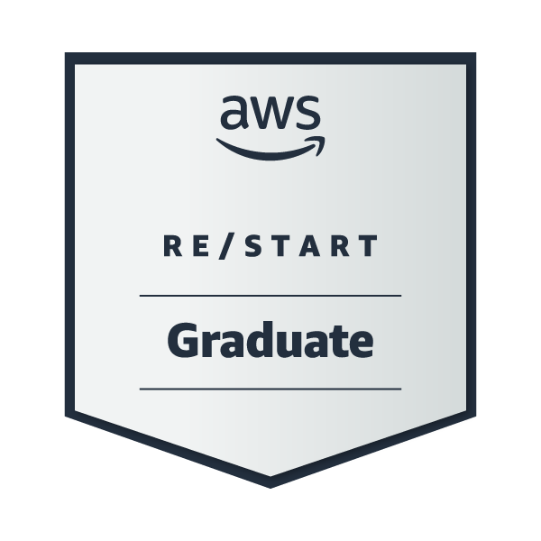
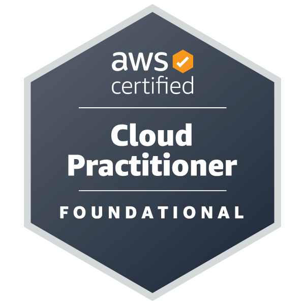
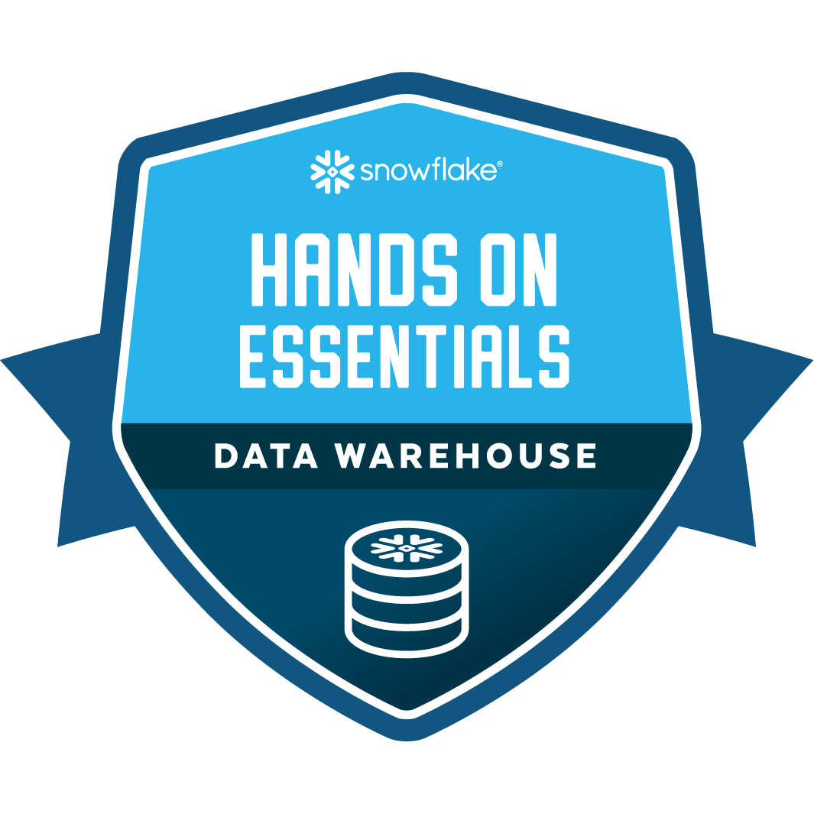
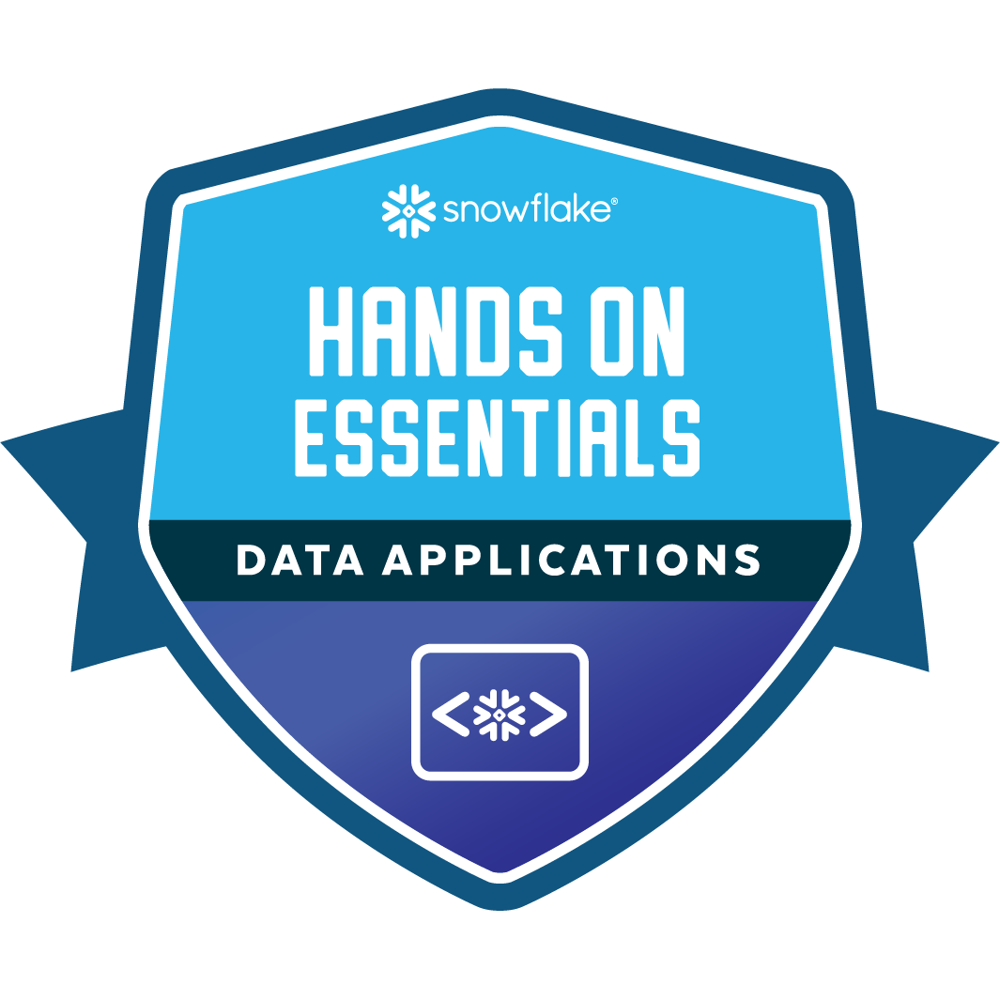

# Henk van der Duim
Data Engineer, currently specializing in Snowflake. Works with VsCode, Python, Tableau, Power BI and deep dives in AI. Writes about data engineering, computational thinking, Artificial intelligence and IT. 

## About Me  
I am:  
👉 curious  
👉 involved  
👉 organizational  
👉 accurate  
👉 goal / solution oriented  
👉 inspiring  
👉 communicative  
👉 driven  
👉 creative  
👉 practical  
👉 getting things done  

I am the author of:  
👉 Ideas as Opiates (poem book)  
👉 Twitter and Personal Branding  
👉 In addition, I have written about 250 Haikus (and still counting...) 

I love to talk about:  
👉 Data Engineering  
👉 Data Science  
👉 Personal Branding  
👉 Computational Thinking  

## Where to find me  
<table>
 <tr>
  <td><a href="https://www.linkedin.com/in/henkvanderduim/"></a></td>
  <td><a href="https://github.com/henkvanderduim"></a></td>
  <td><a href="https://twitter.com/henkvanderduim"></a></td>
  <td><a href="https://instagram.com/henkvanderduim"></a></td>
  <td><a href="https://medium.com/@henkvanderduim"></a></td>
  <td><a href="https://hackernoon.com/u/paperhouse"></a></td>
  <td><a href="https://www.henkvanderduim.nl"></a></td>
 </tr>
</table>  

## Badges
<table>
 <tr>
  <td><a href="https://www.credly.com/badges/3cb9bacd-f323-4383-adb2-6c5968ea0532/public_url"></a></td>
  <td><a href="https://www.credly.com/badges/0050ca83-0416-4886-9cde-fbe5261bc5ab/public_url"></a></td>
  <td><a href="hhttps://www.credly.com/badges/d48a0c30-6bbc-4a05-b213-782e7ed088ca/public_url"></a></td>
  <td><a href="https://www.credly.com/badges/a4038c43-92cb-49d2-9741-970df170ab8c/public_url"></a></td>
 </tr>
</table> 
<!--START_SECTION:waka-->

```text
From: 11 January 2023 - To: 18 January 2023

Total Time: 2 hrs 19 mins

Markdown     1 hr 14 mins    >>>>>>>>>>>>>------------   53.10 %
Python       32 mins         >>>>>>-------------------   23.65 %
CSV          20 mins         >>>>---------------------   14.55 %
Other        6 mins          >------------------------   04.89 %
```

<!--END_SECTION:waka-->
