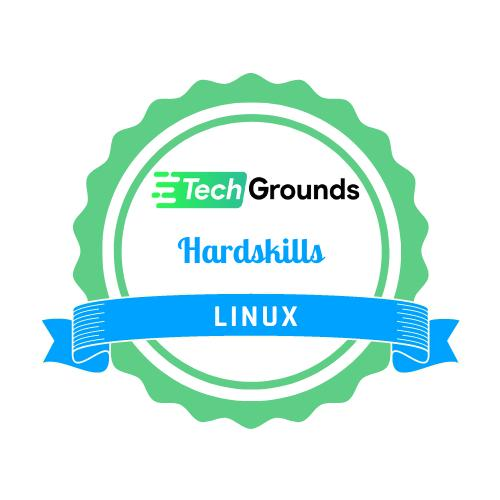
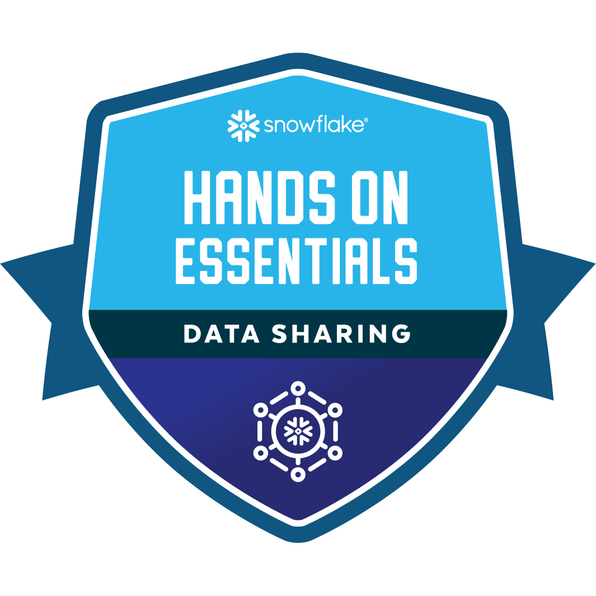
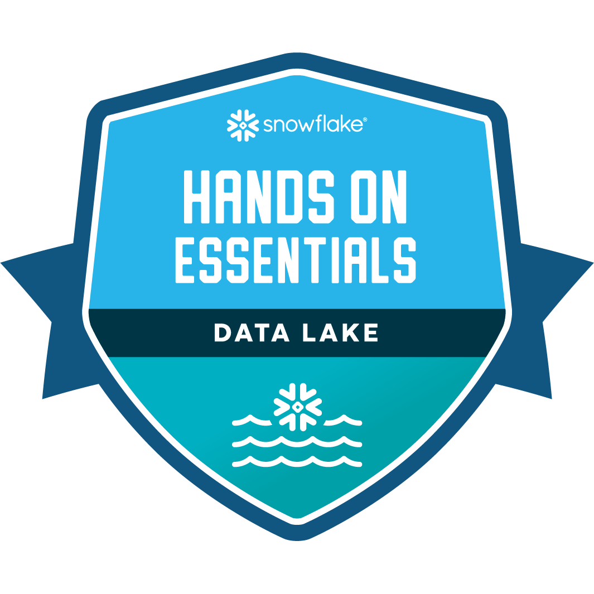
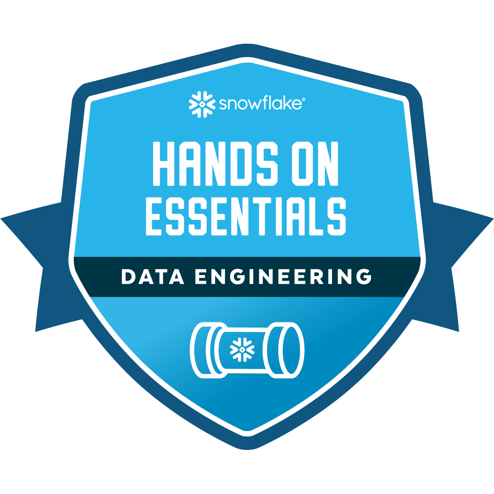

# Henk van der Duim
Data Engineer, currently specializing in Snowflake. Works with VsCode, Python, Tableau, Power BI and deep dives in AI. Writes about data engineering, computational thinking, Artificial intelligence and IT. 

## About Me  
I am:  
👉 curious  
👉 involved  
👉 organizational  
👉 accurate  
👉 goal / solution oriented  
👉 inspiring  
👉 communicative  
👉 driven  
👉 creative  
👉 practical  
👉 getting things done  

I am the author of:  
👉 Ideas as Opiates (book of poems)  
👉 Twitter and Personal Branding  
👉 In addition, I have written about 250 Haikus (and still counting...)  
👉 My articles can be found on my <a href="https://www.henkvanderduim.nl/schrijfwerk/">personal website (Dutch)</a>, and <a href="https://hackernoon.com/u/paperhouse">Hackernoon (English)</a>.

I love to talk and write about:  
👉 Data Engineering  
👉 Data Science  
👉 Personal Branding  
👉 Computational Thinking  
👉 Artificial Intelligence   

👉 An example of my scribblings: <a href="https://hackernoon.com/174-ai-tools-to-try">174 AI-Tools To Try</a>

## Where to find me  
<table>
 <tr>
  <td><a href="https://www.linkedin.com/in/henkvanderduim/"></a></td>
  <td><a href="https://github.com/henkvanderduim"></a></td>
  <td><a href="https://twitter.com/henkvanderduim"></a></td>
  <td><a href="https://instagram.com/henkvanderduim"></a></td>
  <td><a href="https://medium.com/@henkvanderduim"></a></td>
  <td><a href="https://hackernoon.com/u/paperhouse"></a></td>
  <td><a href="https://www.henkvanderduim.nl"></a></td>
 </tr>
</table>  

## Badges
<table>
 <tr>
  <td></td>
  <td><a href="https://www.credly.com/badges/3cb9bacd-f323-4383-adb2-6c5968ea0532/public_url"></a></td>
  <td><a href="https://www.credly.com/badges/0050ca83-0416-4886-9cde-fbe5261bc5ab/public_url"></a></td>
  <td><a href="hhttps://www.credly.com/badges/d48a0c30-6bbc-4a05-b213-782e7ed088ca/public_url"></a></td>
  <td><a href="https://www.credly.com/badges/a4038c43-92cb-49d2-9741-970df170ab8c/public_url"></a></td>
  <td><a href="https://www.credly.com/badges/1f02da06-333c-40fd-b19a-b065dd106284/public_url"></a></td>
   <td><a href="https://www.credly.com/badges/b18f3d9d-34b1-4a9d-849f-3a4d909ded9b/public_url"></a></td>
   <td><a href="https://www.credly.com/badges/1732b0d9-96e4-4050-8059-565eb74fe609/public_url"></a></td>
 </tr>
</table> 
<!--START_SECTION:waka-->

```txt
From: 11 January 2023 - To: 14 August 2025

Total Time: 53 hrs 23 mins

Python       22 hrs 45 mins  >>>>>>>>>>>--------------   42.63 %
SQL          18 hrs 5 mins   >>>>>>>>-----------------   33.87 %
Markdown     5 hrs 8 mins    >>-----------------------   09.62 %
Other        1 hr 33 mins    >------------------------   02.92 %
C#           1 hr 19 mins    >------------------------   02.48 %
```

<!--END_SECTION:waka-->
